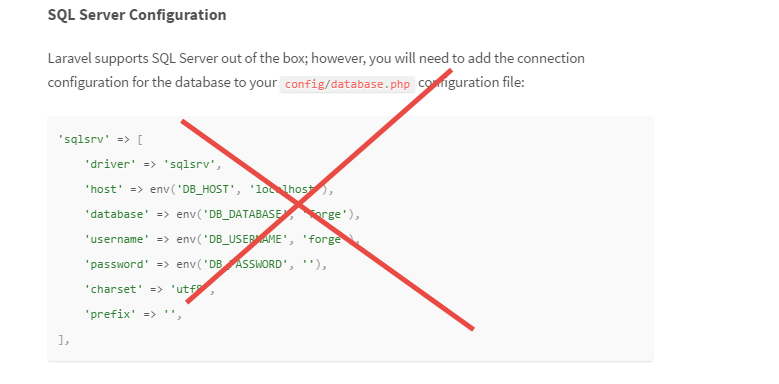
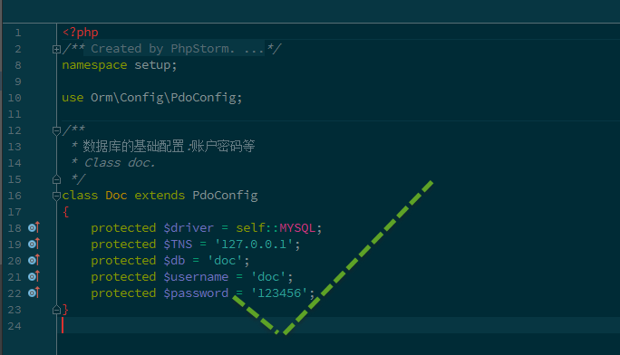

#类 面向对象的设计基础

* 命名方式第一个字母大写
* 如果此类明确不会被继承，在前面加上final限制，如果可以被继承，部分函数应该是final限制
* 所有写入的方法都支持链式调用模型  - 需要工具自动完成配合
* __invoke 函数作为运行的入口

#废弃：数组配置

类似 Laravel 框架采取的配置方式不可取

* 不知道需要配置的索引名到底有几个
* 编写代码的时候没法自动提示，不清楚有没有写错 （生态不全）
* 同样道理，ini，json的配置方式 也是不可取




应该采取面向对象中 虚类继承 的方式来编写配置



#废弃：继承
凡是采用继承的方式 来写功能类，全部不合格。
继承只能用来写配置类。

功能类概念

```
class tool
{
      /**
      * 此处实现功能
      */
      public function __invoke()
     {
     }
}

```

配置类：定义一些配置的属性，供扩展填写

**注意** 配置类基本上所有的方法都是final
```
abstract class xxxConfig
{
    protected name="";
    protected age="";
    ....
    
}
```
#新概念：组合编程 trait

trait 不能嵌套，否则过于复杂

#设计架构
+ 每一处读写都必须存在一份类模型(数据库,请求get/post/cookie,网页结构) 结构化所有