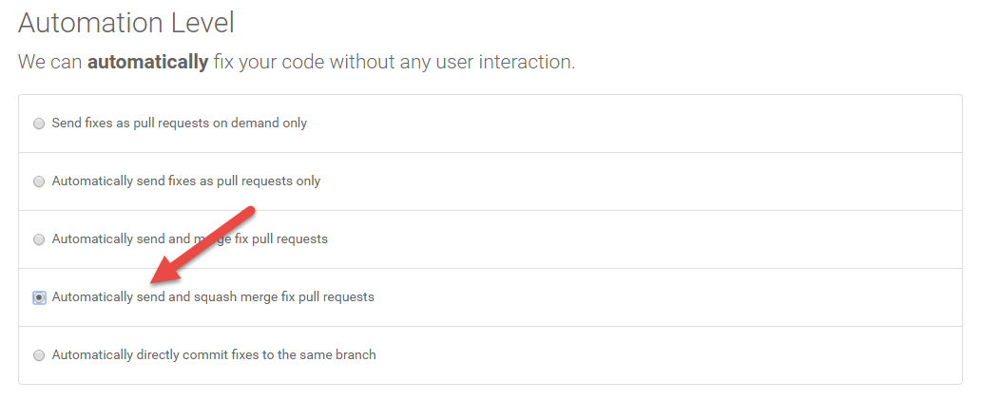

#入门
[官网地址](https://styleci.io/)

[配置文档](https://styleci.readme.io/docs/configuration)

#默认配置 **.styleci.yml**

按照 PSR2 进行检测

```
 preset: PSR2
 risky: false
 
 finder:
   name:
     - "*.php"
   path:
     - "src"
     
```

在项目中设置为自动合并代码

