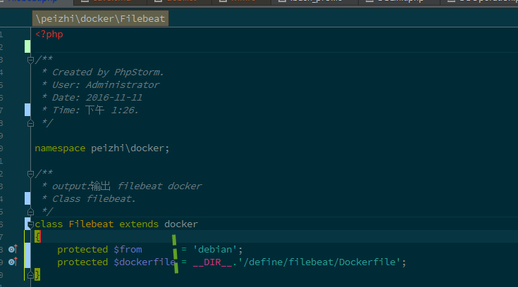

#代码格式化工具

symfony格式更符合规范
>fix  $FilePath$ --level=symfony

额外的附加选项
--fixers=逗号隔开选项名字 [contrib] 类型的都是额外选项

>align_equals

>phpdoc_order

函数的注释上，先参数什么，return一定在最后面

>short_array_syntax

采用 [] 类似json格式来表达数组
#相关入门文档

(http://0x1.im/blog/php/php-cs-fixer.html)