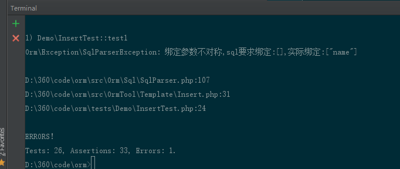

#结构体查看方式
+ 只看对外函数
+ 按照字母排序

#代码格式化

技术支持
[friendsofphp/php-cs-fixer](https://github.com/friendsofphp/php-cs-fixer)

#Phpstrom配置

Alt+下拉箭头 整体往下移动 
Ctrl+下拉箭头 复制当前一行

  
##命令行编码改成utf8

>chcp 65001

效果
